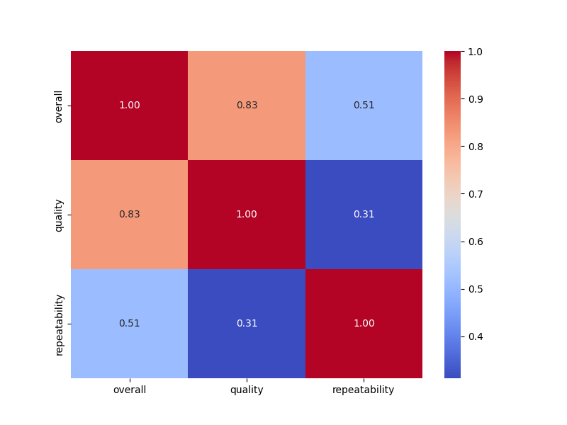
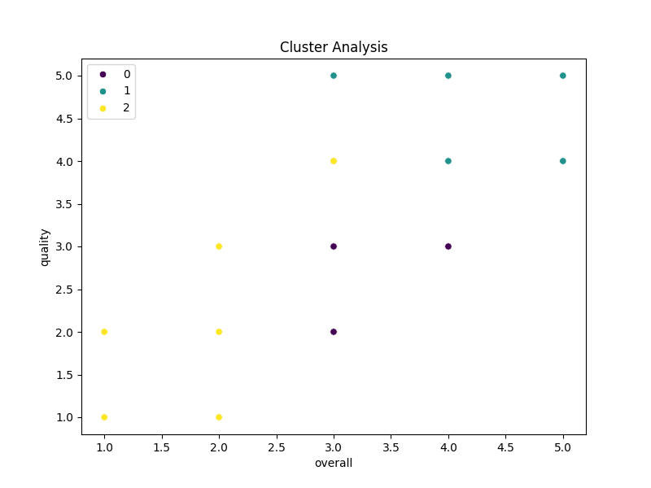

### Story of the Dataset Exploration

#### Introduction: Unveiling Insights

In the world of data analysis, every dataset tells a compelling story, often hidden beneath layers of numbers and categorical information. Today, we dive into a dataset comprising 2652 individual entries, meticulously organized into 8 distinct columns. Each row potentially holds insights about user experiences, perceptions, and the nature of the subjects being evaluated. Our mission is to explore this data, uncover patterns, and offer recommendations that might inform future analyses or decisions.

#### Structure of the Dataset

As we examine the structural framework of our dataset, we find:

- **Row Count**: 2652 entries 
- **Column Diversity**: 8 columns consisting of both categorical and numerical data types.

The columns include:
- `date`: Suggested to represent the timestamp of each entry, albeit as string values.
- `language`: Presumably indicating the language of the entry's content.
- `type`: Represents the category or nature of the entry.
- `title`: Informative titles that could provide context about the entries.
- `by`: Likely reflecting the authors or contributors of each entry.
- `overall`, `quality`, and `repeatability`: Integer ratings that appear to quantify different aspects of the entries, with values ranging from 1 to 5.

#### Missing Values: A Closer Look

Digging deeper, we uncover areas of concern surrounding missing values:
- The `date` column is missing **99 values**, which might represent gaps in temporal context that could affect analyses related to trends over time.
- The `by` column faces a more pronounced issue, with **262 missing values**, creating a significant hole in the attribution of entries and perhaps obscuring the understanding of contributions or authorship.

Despite these challenges, our analysis maintains the integrity of the other columns, which report no missing data.

#### Summary Statistics: The Ratings Landscape

Next, we focus on the numerical columns — the overall, quality, and repeatability ratings — summarizing essential findings:

1. **Overall Ratings**:
   - The mean rating hovers around **3.05**, not just above average but suggesting a central tendency.
   - The standard deviation of **0.76** indicates that while most entries are clustered around the mean, there exists a degree of variability in opinions.
   - Observations reveal that a significant number of ratings are at the midpoint (3), raising questions about user satisfaction and whether this midpoint rating is a reflection of indifference or a common baseline among entries.

2. **Quality Ratings**:
   - With a mean rating of **3.21**, the quality assessment appears slightly favorable compared to overall ratings.
   - Similar variability as in the overall ratings signals some disagreement regarding quality among entries, with many scoring 3 but a tangible push toward 4 (75th percentile).

3. **Repeatability Ratings**:
   - The repeatability metric translates to a mean of **1.49**, suggesting that many rated the consistency or reliability of the entries quite low, primarily clustering at 1. The alarming average might indicate potential reliability issues or dissatisfaction with the subjects' reproducibility. 

#### Insights and Recommendations

Navigating through the intricate layers of this dataset highlights potential pathways for further investigation and improvement:

- **Addressing Missing Data**: Strategies to handle missing values, especially in the `date` and `by` columns, are paramount. Imputation techniques or revisiting data collection methods could enhance the dataset

